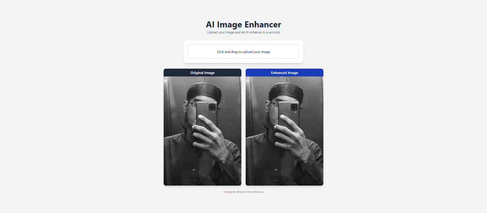

# AI Image Enhancer 

## Description

AI Image Enhancer is a web app that uses the [Picwish AI API](https://picwish.com) to enhance images. The app allows users to upload an image for enhancement, and download the enhanced image.

---

## Technologies Used

- React
- Tailwind CSS
- Picwish AI API
- Axios

---

## Features

- **Image Enhancement:** Users can upload an image and get a enhanced version of it.
- **Download:** Users can download the enhanced image.

---

## Project Breakdown

- **Image Enhancement Logic:** Uses `Picwish AI API` to enhance the image.
- **State Management:** `useState` manages the image state, input image and enhanced image.
- **Component Reusability:** Logic is broken into small, testable components like `ImagePreview`, `ImageUploader`, and `Loading`.

---

## What I Learned

- How to use `useState` hook to manage the image state.
- How to use `Axios` to make `api call`.
- How to use `FormData` to send image to `api call`.

---

## Demo

---

## How to Run

1. Clone the repo
2. Run `npm install` to install dependencies
3. Run `npm run dev` to start the development server
4. Open [http://localhost:5173](http://localhost:5173) to view it in the browser

---

## 🙋‍♂️ About Me

I'm `Hazzaz Abdul Mannan`, a passionate full stack developer with a focus on building clean, interactive, and user-friendly interfaces. I enjoy learning new technologies and continuously improving my skills. This project helped me explore the power of React hooks and the `Picwish AI API`. I also learned about the `FormData` API, which is used to send image to `api call`.
Thank you for checking out my project!
